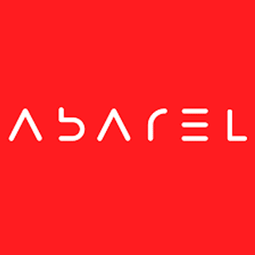

 

# About Abarel Studio

Abarel is a cutting-edge video production and online B2B marketing agency that unleashes boundless creativity. Our expertise spans across crafting captivating brand content, dynamic animated explainers, awesome TV ads, tantalizing food commercials, captivating event coverage, and an array of other exciting offerings. 
From masterpieces born of human ingenuity to groundbreaking ads conjured with the aid of AI, we pride ourselves on pushing the boundaries of what's possible in the realm of creative marketing.

Our productions are made explicitly for all communication purposes. From concept and scriptwriting to image recording and post-production, sound mixing up to delivering the final product for commercials, TV, and social media. Just like that.

## Gallery



## They trusted us

Quisque consequat sapien eget quam rhoncus, sit amet laoreet diam tempus. Aliquam aliquam metus erat, a pulvinar turpis suscipit at.

 

 

<link rel="stylesheet" href="/css/lightbox.css">